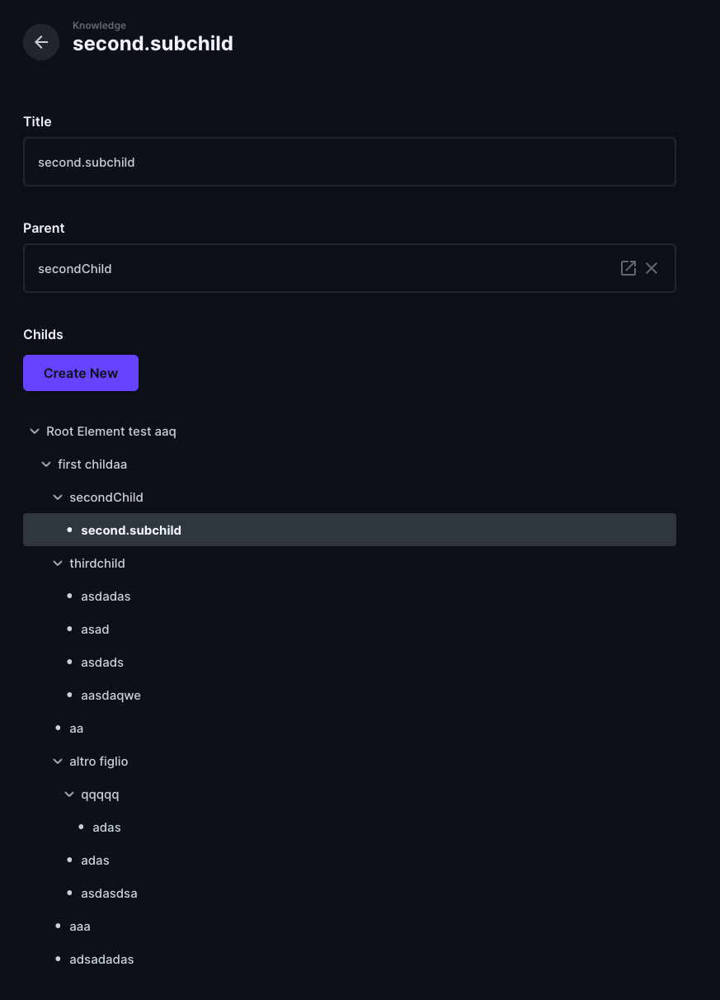

One to Many - Tree View
A Directus extension that provides a tree view (Interface) for one-to-many relationships like the one used by Notion.

## Basic Usage
This extension is based on the Tree View Interface provided by Directus, so use it as you would use the default Tree View interface.
